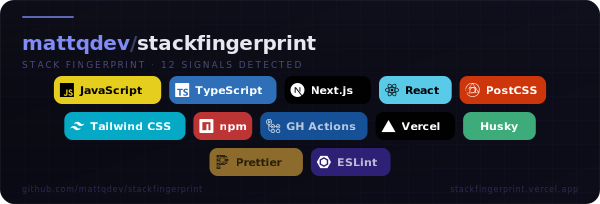

# Stack Fingerprint — Documentation

Technical reference for the Stack Fingerprint API, configuration system, signal database, and GitHub Action integration.

---

## Table of contents

1. [Concepts & terminology](#concepts--terminology)
2. [API reference](#api-reference)
3. [Configuration file — `.stackfingerprint.json`](#configuration-file-stackfingerprintjson)
4. [Themes](#themes)
5. [Layouts](#layouts)
6. [Signal categories](#signal-categories)
7. [Dev-only signals & filtering](#dev-only-signals--filtering)
8. [Monorepo support](#monorepo-support)
9. [GitHub Action](#github-action)
10. [Adding a signal](#adding-a-signal)
11. [Self-hosting](#self-hosting)
12. [Architecture overview](#architecture-overview)
13. [Troubleshooting](#troubleshooting)

---

## Concepts & terminology

### Signal

A **signal** is a single piece of detected technology — one row in the `src/data/signals.js` database. Each signal has:

| Field       | Type      | Description                                                                             |
| ----------- | --------- | --------------------------------------------------------------------------------------- |
| `id`        | `string`  | Unique, lowercase, hyphen-separated identifier (e.g. `nextjs`, `vitest`)                |
| `label`     | `string`  | Human-readable display name shown on the card pill (e.g. `Next.js`)                     |
| `category`  | `string`  | Logical grouping — see [Signal categories](#signal-categories)                          |
| `iconSlug`  | `string`  | Simple Icons slug used to fetch the brand icon                                          |
| `color`     | `string`  | Hex colour used for the pill background / icon tint                                     |
| `match`     | `object`  | Detection rules — `files`, `deps`, `devDeps`, `dirs`, `content`                         |
| `isDevOnly` | `boolean` | Set automatically by `detect.js` when evidence comes exclusively from `devDependencies` |

### Pill

The visual chip rendered inside the SVG card for each detected signal. A pill displays the signal's icon and label. Dev-only pills are rendered at **55 % opacity** in `all` filter mode so the production stack stays visually dominant.

### Theme

A named colour palette applied to the card background, borders, text, and pill styles. Themes do not affect detection — only presentation.

### Layout

A structural template that controls how pills are arranged inside the card (grid, row, terminal prompt, banner strip, etc.).

### Category filter (`categoryFilter`)

A query parameter that controls which signals reach the SVG renderer:

| Value             | Behaviour                                                                                                       |
| ----------------- | --------------------------------------------------------------------------------------------------------------- |
| `all` _(default)_ | All detected signals. Dev-only pills are dimmed.                                                                |
| `prodonly`        | Only signals sourced from `dependencies`, config files, or directory structures — never from `devDependencies`. |
| `top`             | Only signals in the `lang` and `framework` categories, capped at 5. Ideal for a concise, honest badge.          |

### Detection signal vs. false positive

A **false positive** is a signal that appears on the card but does not reflect a technology the team actively uses. Common causes:

- A package appears in `devDependencies` only (e.g. Babel used by a build tool internally).
- A lockfile contains a transitive dependency whose config file happens to match a detection rule.
- The `.stackfingerprint.json` `ignore` list is the correct remedy for persistent false positives.

---

## API reference

### `GET /api/card`

Returns a self-contained SVG card for the requested repository.

#### Query parameters

| Parameter        | Required | Type                                             | Default    | Description                                                              |
| ---------------- | -------- | ------------------------------------------------ | ---------- | ------------------------------------------------------------------------ |
| `repo`           | ✅       | `owner/repo`                                     | —          | GitHub repository to scan                                                |
| `theme`          |          | `string`                                         | `midnight` | Card colour theme — see [Themes](#themes)                                |
| `layout`         |          | `string`                                         | `classic`  | Card layout — see [Layouts](#layouts)                                    |
| `size`           |          | `sm` `md` `lg` `xl`                              | `md`       | Scale multiplier: 0.75× / 1.0× / 1.35× / 1.6×                            |
| `iconStyle`      |          | `color` `mono` `none` `icononly`                 | `color`    | Icon rendering style                                                     |
| `pillShape`      |          | `pill` `round` `square`                          | `round`    | Pill corner radius                                                       |
| `categoryFilter` |          | `all` `prodonly` `top` `core` `devtools` `infra` | `all`      | Signal filter — see [Signal categories](#signal-categories)              |
| `accentLine`     |          | `bar` `gradient` `dots` `none`                   | `bar`      | Decorative line near the card top                                        |
| `bgDecoration`   |          | `none` `grid` `dots` `noise` `circuit`           | `grid`     | Background texture                                                       |
| `path`           |          | `string`                                         | _(root)_   | Sub-path to scan (monorepo)                                              |
| `devOnly`        |          | `0` `1`                                          | `1`        | `0` hides all dev-only signals — shorthand for `categoryFilter=prodonly` |

#### Example requests

```
# Minimal — scan from root, all defaults
GET /api/card?repo=vercel/next.js

# Monorepo — scan apps/web only
GET /api/card?repo=myorg/monorepo&path=apps/web

# Production-only signals, compact layout, dark theme
GET /api/card?repo=myorg/myrepo&categoryFilter=prodonly&layout=compact&theme=obsidian

# Top 5 signals only — cleanest possible badge
GET /api/card?repo=myorg/myrepo&categoryFilter=top&size=sm
```

#### Response

`Content-Type: image/svg+xml`

A fully self-contained SVG. Brand icons are inlined as base64, making the card render correctly in all environments including GitHub READMEs.

#### Error responses

| HTTP code | Meaning                                           |
| --------- | ------------------------------------------------- |
| `400`     | Missing or malformed `repo` parameter             |
| `404`     | Repository not found or not public                |
| `422`     | Repository found but no signals detected          |
| `500`     | Internal error (GitHub API failure, render error) |

---

## Configuration file — `.stackfingerprint.json`

Drop this file at the root of your repository (or at the sub-path you are scanning) to control signal detection and card presentation without changing any URL parameter. The API reads this file before rendering; every field can be overridden at runtime via an equivalent query parameter.

> A machine-readable JSON Schema is available at [`.stackfingerprint.schema.json`](./.stackfingerprint.schema.json). Add `"$schema": "https://stackfingerprint.vercel.app/schema/.stackfingerprint.json"` to your config file to get IDE autocompletion in VS Code, WebStorm, and other editors that support JSON Schema.

### Full reference

```json
{
  "$schema": "https://stackfingerprint.vercel.app/schema/.stackfingerprint.json",

  "ignore": ["babel", "webpack", "terraform"],
  "pin": ["nextjs", "typescript"],
  "labels": { "nextjs": "Next.js 15", "react": "React 19" },
  "path": "apps/web",

  "card": {
    "theme": "ocean",
    "layout": "classic",
    "size": "md",
    "iconStyle": "color",
    "pillShape": "round",
    "categoryFilter": "prodonly",
    "accentLine": "bar",
    "bgDecoration": "grid",
    "dataFields": {
      "repoName": true,
      "signalCount": true,
      "footerUrl": true,
      "brandLabel": true,
      "categoryDots": false,
      "overflowBadge": true
    }
  }
}
```

### Top-level fields

| Field    | Type               | Default   | Description                                                                                                             |
| -------- | ------------------ | --------- | ----------------------------------------------------------------------------------------------------------------------- |
| `ignore` | `string[]`         | `[]`      | Signal IDs to suppress, even if auto-detected. Applied before any `categoryFilter`. Use for persistent false positives. |
| `pin`    | `string[]`         | `[]`      | Signal IDs to always show, in the order listed, before all other signals. Never hidden by `categoryFilter`.             |
| `labels` | `{ [id]: string }` | `{}`      | Override the pill display label for any signal ID. Does not affect detection or sorting. Max 40 characters per label.   |
| `path`   | `string \| null`   | `null`    | Default sub-directory to scan for monorepos. Overridden by the `?path=` query parameter.                                |
| `card`   | `object`           | see below | Default visual preferences. Every sub-field is overridden by the equivalent URL query parameter.                        |

### `card` fields

| Field            | Type     | Default    | Values                                           | Description                                        |
| ---------------- | -------- | ---------- | ------------------------------------------------ | -------------------------------------------------- |
| `theme`          | `string` | `midnight` | See [Themes](#themes)                            | Colour palette for the card                        |
| `layout`         | `string` | `classic`  | See [Layouts](#layouts)                          | Structural template for pill arrangement           |
| `size`           | `string` | `md`       | `sm` `md` `lg` `xl`                              | Scale multiplier: 0.75× / 1.0× / 1.35× / 1.6×      |
| `iconStyle`      | `string` | `color`    | `color` `mono` `none` `icononly`                 | How brand icons are rendered inside pills          |
| `pillShape`      | `string` | `round`    | `pill` `round` `square`                          | Corner radius of pill chips                        |
| `categoryFilter` | `string` | `all`      | `all` `prodonly` `top` `core` `devtools` `infra` | Which signal categories to render                  |
| `accentLine`     | `string` | `bar`      | `bar` `gradient` `dots` `none`                   | Decorative line near the top of the card           |
| `bgDecoration`   | `string` | `grid`     | `none` `grid` `dots` `noise` `circuit`           | Subtle texture overlaid on the background gradient |
| `dataFields`     | `object` | —          | see below                                        | Toggles for metadata elements in the card chrome   |

### `card.dataFields` toggles

| Field           | Default | Description                                                               |
| --------------- | ------- | ------------------------------------------------------------------------- |
| `repoName`      | `true`  | Show the `owner/repo` heading                                             |
| `signalCount`   | `true`  | Show the "N SIGNALS DETECTED" sub-heading                                 |
| `footerUrl`     | `true`  | Show `github.com/owner/repo` in the footer                                |
| `brandLabel`    | `true`  | Show `stackfingerprint.vercel.app` in the footer                          |
| `categoryDots`  | `false` | Show category-colour indicator dots on each pill _(experimental)_         |
| `overflowBadge` | `true`  | Show a `+N` badge when detected signals exceed the layout's pill capacity |

### `categoryFilter` values

| Value      | What is shown                                                                                         |
| ---------- | ----------------------------------------------------------------------------------------------------- |
| `all`      | Every detected signal; dev-only pills dimmed to 55 % opacity                                          |
| `prodonly` | Signals sourced from `dependencies`, config files, or directories only — no `devDependencies` signals |
| `top`      | `lang` + `framework` categories only, capped at 5 signals                                             |
| `core`     | `lang` + `framework` + `runtime` categories                                                           |
| `devtools` | `build` + `pkgmgr` + `testing` + `lint` categories                                                    |
| `infra`    | `cicd` + `infra` + `db` categories                                                                    |

### `iconStyle` values

| Value      | Description                                                               |
| ---------- | ------------------------------------------------------------------------- |
| `color`    | Brand colours from the Simple Icons palette (default)                     |
| `mono`     | All icons tinted with the card's accent colour                            |
| `none`     | No icons — text labels only                                               |
| `icononly` | Square icon tiles with no text label; best paired with the `icons` layout |

### Precedence rules

- `?path=` URL param > `path` in config file > repository root
- `pin` IDs always appear, regardless of `categoryFilter`
- `ignore` IDs are removed first, before `pin` and `categoryFilter` are applied
- Every `card.*` field is overridden by its equivalent URL query parameter when explicitly provided

### Example — eliminating false positives in a large repo

```json
{
  "ignore": ["rspec", "terraform", "babel"],
  "labels": {
    "react": "React 18",
    "typescript": "TypeScript 5"
  }
}
```

---

## Themes

20 themes are available. The `card.theme` config key and the `?theme=` query parameter accept any of the IDs in the first column.

| Theme ID    | Emoji | Style | Character                                        |
| ----------- | ----- | ----- | ------------------------------------------------ |
| `midnight`  | 🌑    | Dark  | Deep blue-black with indigo accent — the default |
| `arctic`    | 🧊    | Light | Cool indigo-white with periwinkle border         |
| `forest`    | 🌲    | Dark  | Near-black green with bright green accent        |
| `ember`     | 🔥    | Dark  | Near-black brown with orange accent              |
| `ocean`     | 🌊    | Dark  | Deep navy with electric cyan                     |
| `obsidian`  | 🪨    | Dark  | Pure dark charcoal with silver/grey              |
| `sakura`    | 🌸    | Dark  | Dark plum-rose with pink accent                  |
| `golden`    | ✨    | Dark  | Dark brown with gold/amber accent                |
| `rose`      | 🌹    | Light | Pale rose-white with crimson accent              |
| `nord`      | ❄️    | Dark  | Arctic blue-grey with teal accent                |
| `nebula`    | 🔭    | Dark  | Near-black purple with violet accent             |
| `parchment` | 📜    | Light | Warm cream with brown leather tones              |
| `matrix`    | 👾    | Dark  | Pure black with neon green — hacker terminal     |
| `lavender`  | 💜    | Light | Soft lavender white with purple accent           |
| `sunset`    | 🌅    | Dark  | Near-black with coral/rose accent                |
| `dracula`   | 🧛    | Dark  | Classic Dracula dark grey with purple            |
| `cyber`     | ⚡    | Dark  | Deep dark blue with electric yellow              |
| `monokai`   | 🎨    | Dark  | Warm dark grey with lime green accent            |
| `slate`     | 🩶    | Light | Cool blue-grey white with dark slate             |
| `abyss`     | 🌀    | Dark  | Very deep teal-black with aqua accent            |

Themes can be previewed in the [Visual Builder](https://stackfingerprint.vercel.app).

---

## Layouts

10 layouts are available. Base width is fixed per layout; height adapts to content.

| Layout ID  | Base width | Description                                                                | Best for                                      |
| ---------- | ---------- | -------------------------------------------------------------------------- | --------------------------------------------- |
| `classic`  | 600 px     | Header + centred pill rows. Default.                                       | General READMEs                               |
| `compact`  | 500 px     | Smaller padding and font, minimal height                                   | Inline badges, small embeds                   |
| `banner`   | 760 px     | Wide landscape, generous pill spacing                                      | Project pages, social previews                |
| `tall`     | 380 px     | Portrait, pills grouped by category with section labels                    | Detailed stack showcase                       |
| `terminal` | 600 px     | Monospace CLI-style text readout — no pill icons                           | Dev tool / CLI projects                       |
| `minimal`  | 560 px     | Pills only, zero chrome (no header, no footer)                             | Embeds where the repo name is already visible |
| `icons`    | dynamic    | Icon-only squares in a 12-column grid, no text labels                      | Dense visual glance at a large stack          |
| `sidebar`  | 160 px     | Narrow vertical strip, one pill per row (or 3-col icon grid)               | README sidebar, wiki margin                   |
| `split`    | 680 px     | Left panel: repo info + category summary · Right panel: pill grid          | Portfolio pages, project showcases            |
| `cards`    | dynamic    | Each technology gets its own named tile with icon + label + category badge | Detailed showcase with 6–20 technologies      |

---

## Signal categories

Categories group signals logically. The `categoryFilter` parameter controls which categories are rendered.

| Category ID  | Label       | Order | `top` | `core` | `devtools` | `infra` | Example signals                           |
| ------------ | ----------- | ----- | ----- | ------ | ---------- | ------- | ----------------------------------------- |
| `lang`       | Language    | 0     | ✅    | ✅     |            |         | TypeScript, JavaScript, Python, Rust, Go  |
| `framework`  | Framework   | 1     | ✅    | ✅     |            |         | Next.js, Django, Rails, FastAPI, Remix    |
| `ui`         | UI          | 2     |       | ✅     |            |         | Tailwind CSS, shadcn/ui, Radix UI, Sass   |
| `runtime`    | Runtime     | 3     |       | ✅     |            |         | Node.js, Deno, Bun, Docker, Kubernetes    |
| `build`      | Build Tool  | 4     |       |        | ✅         |         | Vite, webpack, Rollup, esbuild, Turbo     |
| `pkgmgr`     | Package Mgr | 5     |       |        | ✅         |         | npm, yarn, pnpm, bun, pip, poetry         |
| `db`         | Database    | 6     |       |        |            | ✅      | Prisma, Drizzle, Supabase, Redis, SQLite  |
| `auth`       | Auth        | 7     |       |        |            |         | NextAuth, Clerk, Auth0, Lucia             |
| `state`      | State       | 8     |       |        |            |         | Redux, Zustand, Jotai, MobX, XState       |
| `testing`    | Testing     | 9     |       |        | ✅         |         | Vitest, Jest, Playwright, Cypress, pytest |
| `cicd`       | CI/CD       | 10    |       |        |            | ✅      | GitHub Actions, CircleCI, Jenkins, Drone  |
| `infra`      | Infra       | 11    |       |        |            | ✅      | Vercel, Terraform, AWS CDK, Helm, Ansible |
| `monitoring` | Monitoring  | 12    |       |        |            |         | Sentry, Datadog, Grafana, OpenTelemetry   |
| `mobile`     | Mobile      | 13    |       |        |            |         | React Native, Flutter, Ionic              |
| `ai`         | AI / ML     | 14    |       |        |            |         | LangChain, OpenAI SDK, PyTorch, Jupyter   |
| `lint`       | Linting     | 15    |       |        | ✅         |         | ESLint, Prettier, Biome, Ruff, RuboCop    |

---

## Dev-only signals & filtering

### How detection classifies dev signals

`detect.js` reads `package.json` and classifies each detected signal as **dev-only** (`isDevOnly: true`) if:

1. The matching package appears exclusively in `devDependencies`, **or**
2. The signal's ID is in the `INHERENTLY_DEV` set — a hard-coded list of 30+ signals that are always considered dev tooling regardless of where they appear (linters, CI runners, build tools, test frameworks, etc.).

### Visual dimming

In `categoryFilter=all` mode, dev-only pills are rendered at **55 % opacity**. The production stack (full opacity) naturally draws the eye; the dev tooling is visible but secondary.

### Filtering options

| Goal                                       | Approach                                           |
| ------------------------------------------ | -------------------------------------------------- |
| Show everything, but deemphasise dev tools | `categoryFilter=all` (default)                     |
| Hide all dev tools completely              | `categoryFilter=prodonly` or `?devOnly=0`          |
| Show only the 2–5 most important signals   | `categoryFilter=top`                               |
| Suppress a specific signal permanently     | Add its ID to `ignore` in `.stackfingerprint.json` |

---

## Monorepo support

For repositories with multiple sub-projects, scanning from the root returns signals from all of them, which often produces noise.

### Using `?path=`

```
/api/card?repo=myorg/monorepo&path=apps/web
```

Only the `apps/web` directory and its children are scanned.

### Using `.stackfingerprint.json`

Place a `.stackfingerprint.json` file inside the sub-path with a `path` key, or place it at the repo root referencing the sub-path:

```json
{ "path": "apps/web" }
```

### Scanning multiple sub-projects

Generate a separate card per sub-project by calling the API multiple times with different `path` values:

```markdown
### Frontend


### Backend


```

---

## GitHub Action

The Action fetches the SVG at CI time on GitHub's own infrastructure, validates it, and commits it to the repository. After setup, the README references the local file — no external image loading at render time.

### Setup

1. Create the directory: `mkdir -p .github/workflows assets`
2. Copy the workflow from the README (or below) to `.github/workflows/stack-fingerprint.yml`
3. Update your README to use the local path:

```markdown

```

4. Push — the Action runs on the first push to `main` and weekly thereafter.

### Full workflow file

```yaml
name: Update Stack Fingerprint

on:
  push:
    branches: [main]
  schedule:
    - cron: "0 3 * * 1"
  workflow_dispatch:
    inputs:
      theme:
        description: Card theme
        default: ocean
      layout:
        description: Card layout
        default: classic
      size:
        description: Card size (sm / md / lg)
        default: md
      path:
        description: Sub-path to scan (leave blank for root)
        default: ""

jobs:
  update-card:
    runs-on: ubuntu-latest
    permissions:
      contents: write

    steps:
      - uses: actions/checkout@v4

      - name: Fetch Stack Fingerprint SVG
        run: |
          REPO="${{ github.repository }}"
          THEME="${{ inputs.theme || 'ocean' }}"
          LAYOUT="${{ inputs.layout || 'classic' }}"
          SIZE="${{ inputs.size || 'md' }}"
          PATH_PARAM="${{ inputs.path }}"

          URL="https://stackfingerprint.vercel.app/api/card?repo=${REPO}&theme=${THEME}&layout=${LAYOUT}&size=${SIZE}"
          [ -n "$PATH_PARAM" ] && URL="${URL}&path=${PATH_PARAM}"

          mkdir -p assets
          HTTP_CODE=$(curl -s -o assets/stack-fingerprint.svg -w "%{http_code}" "$URL")

          if [ "$HTTP_CODE" != "200" ]; then
            echo "API returned HTTP $HTTP_CODE — aborting." && exit 1
          fi

          if ! grep -q "<svg" assets/stack-fingerprint.svg; then
            echo "Response does not look like an SVG — aborting." && exit 1
          fi

      - name: Commit if changed
        run: |
          git config user.name  "github-actions[bot]"
          git config user.email "github-actions[bot]@users.noreply.github.com"
          git add assets/stack-fingerprint.svg
          git diff --cached --quiet || git commit -m "chore: update stack fingerprint card"
          git push
```

### Behaviour

- **Idempotent** — if the SVG has not changed, no commit is made.
- **Validated** — the Action aborts if the API returns a non-200 status or a non-SVG body.
- **Manual trigger** — use `workflow_dispatch` to regenerate the card on demand with custom parameters (theme, layout, size, path).
- **Self-hosted compatible** — change the base URL in the `curl` command to point at your own instance.

---

## Adding a signal

Detection signals live in `src/data/signals.js`. Each entry follows this schema:

```js
{
  id: "vitest",             // unique lowercase ID
  label: "Vitest",          // display name on the pill
  category: "test",         // see Signal categories
  iconSlug: "vitest",       // Simple Icons slug (https://simpleicons.org)
  color: "#6E9F18",         // hex colour for the pill
  match: {
    // At least one match rule is required:
    files:   ["vitest.config.ts", "vitest.config.js"],  // filenames to look for
    deps:    ["vitest"],                                  // packages in dependencies
    devDeps: ["vitest"],                                  // packages in devDependencies
    dirs:    ["__tests__"],                               // directory names
    content: { file: "package.json", pattern: "vitest" } // content substring match
  },
}
```

### Tips for accurate signals

- Use `devDeps` instead of `deps` for packages that are always installed as dev dependencies. This ensures `isDevOnly` is set correctly and the pill is dimmed in `all` mode.
- Prefer `files` matches over `content` matches — they are faster and less prone to false positives.
- Test against both a minimal repo (does it detect correctly?) and a large repo (does it produce false positives?).
- Open an issue before submitting large batches of new signals.

---

## Self-hosting

Stack Fingerprint is a standard Next.js application. Any platform that can run Next.js can host it.

### Vercel (one click)

[](https://vercel.com/new/clone?repository-url=https://github.com/mattqdev/stackfingerprint)

### Manual deployment

```bash
git clone https://github.com/mattqdev/stackfingerprint.git
cd stackfingerprint
npm install
npm run build
npm start
```

### Environment variables

No environment variables are required. The GitHub Contents API is used unauthenticated for public repositories.

To avoid rate-limiting on busy instances, set a `GITHUB_TOKEN` with read-only public access:

```env
GITHUB_TOKEN=ghp_...
```

---

## Architecture overview

```
User / GitHub Action
       │
       ▼
GET /api/card?repo=…&path=…&theme=…&categoryFilter=…
       │
       ├─ route.js          — validates params, reads ?path=, reads ?categoryFilter=
       │
       ├─ detect.js         — fetches file tree via GitHub Contents API
       │                      reads .stackfingerprint.json (ignore / pin / labels)
       │                      applies dependency vs devDependency classification
       │                      sets isDevOnly on each signal
       │
       ├─ cardOptions.js    — applies categoryFilter (all / prodonly / top)
       │                      applies ignore / pin from config file
       │
       └─ svgBuilder.js     — renders pills with brand icons (base64 inlined)
                              dims isDevOnly pills at 55% opacity in `all` mode
                              returns image/svg+xml
```

---

## Troubleshooting

### The card shows signals I do not use

Add the signal IDs to the `ignore` list in `.stackfingerprint.json`:

```json
{ "ignore": ["babel", "terraform"] }
```

If the signal is appearing because of a transitive `devDependency`, switching to `categoryFilter=prodonly` will also remove it.

### The card is missing a technology we use

If the technology is not auto-detected, pin it manually:

```json
{ "pin": ["postgres", "redis"] }
```

If it should be auto-detected, [open an issue](https://github.com/mattqdev/stackfingerprint/issues) or [contribute a signal](#adding-a-signal).

### The card includes signals from other sub-projects in our monorepo

Use the `?path=` parameter (or the `path` key in `.stackfingerprint.json`) to restrict the scan to a specific sub-directory.

### The SVG does not render in my README

GitHub proxies external images through Camo. If the external domain is unavailable, the image breaks. The fix is to [use the GitHub Action](#github-action) to commit the SVG locally.

### The GitHub Action fails with "not an SVG"

This usually means the API returned an error page. Check the raw response:

```bash
curl -v "https://stackfingerprint.vercel.app/api/card?repo=OWNER/REPO"
```

Common causes: the repository is private, the repo path is misspelled, or the GitHub API is rate-limiting the server.

---

_Stack Fingerprint is MIT-licensed. Contributions welcome — please open an issue before submitting a PR._
