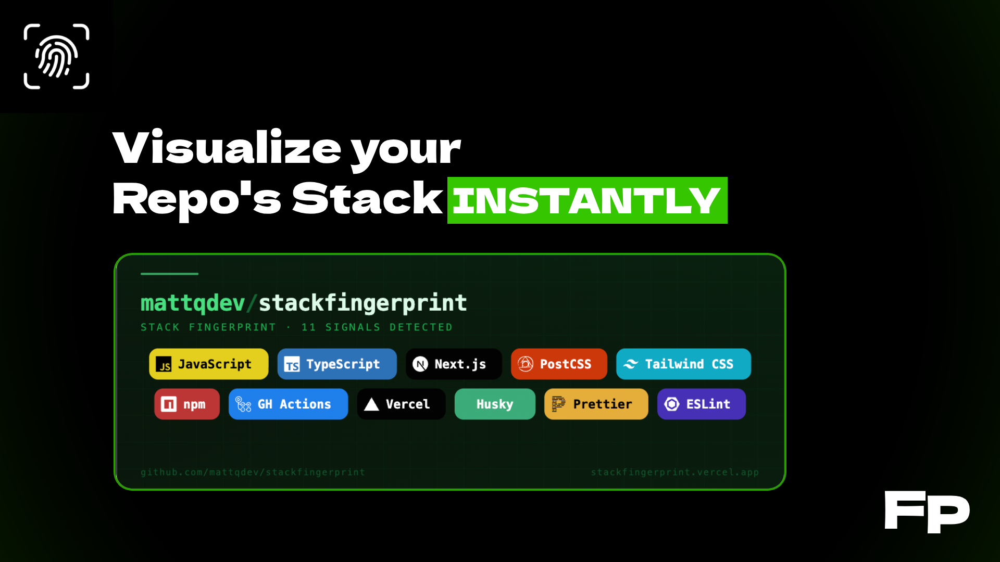
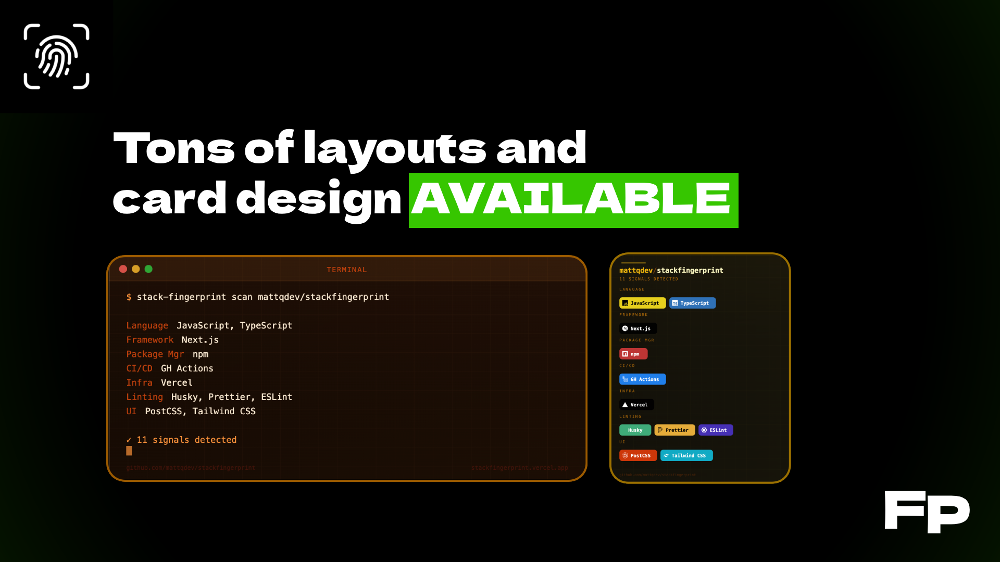

# 🔍 Stack Fingerprint

**Scan any public GitHub repo and generate a beautiful, embeddable SVG card of its tech stack.**

Zero auth. Zero config. Paste a repo, get a badge.

[](https://stackfingerprint.vercel.app)
[](https://github.com/mattqdev/stackfingerprint)
[](https://github.com/mattqdev/stackfingerprint/blob/main/LICENSE)

---


---

## ✨ Design Your Card Visually

You don't need to touch a line of code to get the perfect look. The **Interactive Visual Builder** lets you customise your fingerprint in real-time:

- **Real-time preview** — see changes instantly as you toggle themes and layouts
- **10+ designer themes** — from the deep tones of `Obsidian` to the vibrant `Sakura`
- **5 distinct layouts** — choose `Terminal` for dev tools or `Banner` for project headers
- **One-click copy** — grab the Markdown or HTML snippet and drop it straight into your README

[**Try the Visual Builder →**](https://stackfingerprint.vercel.app)




---

## 📄 Quick embed (no Action required)

If you just want to try it without setting up the Action, paste this into your README:

```markdown

```

Customise with query parameters (see [API reference](./DOCS.md#api-reference)):

```markdown

```

---

## 🔴 Common Problems

The community reported these most common problems, we have decided to fix all:
| ❌ Problem | ✅ Fix |
| ------------------------------------------------------------------------------------------------------ | -------------------------------------------------------------------------------------------------------------------------------------------------------------------------- |
| The embed is from an uncontrolled third-party domain | Host it yourself easily with Vercel or just paste `.github/workflows/stack-fingerprint.yml` in your repo (recommended) |
| Some of the stacks detected are unused/false positive/insignificant | You can choose to show: Top 5 stacks, Core only, Prod only etc; If this isn't enough you can decide to exclude singular stacks with `"ignore"` in `.stackfingerprint.json` |
| Full-repo scan surfaces signals from unrelated sub-projects | `?path=` query parameter scans a specific sub-directory; |
| Long signal lists discourage contributors and misrepresent the actual stack | `categoryFilter=prodonly` hides all dev signals; `categoryFilter=top` shows only `lang` + `framework`, capped at 5; dev-only signals visually dimmed even in `all` mode. You have the **FULL CONTROL** of **WHAT TO SHOW**. |

---

## ⚙️ Configuration file

Drop a `.stackfingerprint.json` file at your repo root (or at the sub-path you are scanning) to tune detection without touching any API parameter:

```json
{
  "ignore": ["babel", "webpack", "terraform"],
  "pin": ["nextjs", "typescript"],
  "labels": { "nextjs": "Next.js 14" },
  "path": "apps/web"
}
```

| Key      | Type       | Description                                                                  |
| -------- | ---------- | ---------------------------------------------------------------------------- |
| `ignore` | `string[]` | Signal IDs to suppress from the card, even if detected                       |
| `pin`    | `string[]` | Signal IDs to always show, even if not auto-detected                         |
| `labels` | `object`   | Override the display label for any signal ID                                 |
| `path`   | `string`   | Default sub-path for monorepo scans (overridden by the `?path=` query param) |

See [DOCS.md → Configuration file](./DOCS.md#configuration-file-stackfingerprintjson) for the full schema.

---

## 🛡 Supply-chain safety & self-hosting

> ⚠️ **Self-hosting recommended for production use.** See [Supply-chain safety](#-supply-chain-safety--self-hosting) below.

Embedding an image from a third-party domain (`stackfingerprint.vercel.app`) in a high-profile README introduces supply-chain risk: the domain owner can change what the URL serves at any time. **The recommended approach is to commit the SVG directly to your repository so it is served from GitHub's own CDN.**

The easiest way to do this is with the included GitHub Action.

### GitHub Action (recommended)

Drop `.github/workflows/stack-fingerprint.yml` into your repo:

Then reference the committed file in your README:

```markdown

```

The SVG is now served from `raw.githubusercontent.com` — GitHub's own CDN — with no runtime dependency on `stackfingerprint.vercel.app`.

### Deploy your own instance

For complete control, deploy a private instance in one click:

[](https://vercel.com/new/clone?repository-url=https://github.com/mattqdev/stackfingerprint)

Point the Action's `URL` at your own domain and you own the entire pipeline.

---

## 🏗 Monorepo support

For monorepos, add `?path=apps/web` to scan a sub-directory instead of the repository root:

```markdown

```

The `path` parameter is also accepted by the GitHub Action as a `workflow_dispatch` input and as a key in `.stackfingerprint.json`.

---

## 🎨 Card options at a glance

| Parameter        | Values                                            | Default   | Description                             |
| ---------------- | ------------------------------------------------- | --------- | --------------------------------------- |
| `repo`           | `owner/repo`                                      | —         | **Required.** GitHub repository to scan |
| `theme`          | See [themes](./DOCS.md#themes)                    | `ocean`   | Visual colour theme                     |
| `layout`         | `classic` `compact` `minimal` `terminal` `banner` | `classic` | Card layout                             |
| `size`           | `sm` `md` `lg`                                    | `md`      | Card size                               |
| `iconStyle`      | `color` `mono` `outline`                          | `color`   | Icon rendering style                    |
| `pillShape`      | `round` `square`                                  | `round`   | Shape of tech pills                     |
| `categoryFilter` | `all` `prodonly` `top`                            | `all`     | Signal filter (see below)               |
| `path`           | `apps/web` etc.                                   | _(root)_  | Monorepo sub-path                       |

### `categoryFilter` options

| Value      | What it shows                                                                            |
| ---------- | ---------------------------------------------------------------------------------------- |
| `all`      | Every detected signal; dev-only signals are dimmed at 55 % opacity                       |
| `prodonly` | Production signals only — all `devDependencies`-sourced signals are hidden               |
| `top`      | Only `lang` + `framework` categories, capped at 5 signals — the minimal meaningful badge |

---

## 🛠 Contributing & support

This project thrives on community input. Before opening a pull request, **please open an issue first** so we can discuss the goal and make sure it is a good fit.

### Help grow the signal database

Is your favourite framework missing? Adding a new detection signal is as easy as adding a JSON object to `src/data/signals.js`:

```js
{
  id: "astro",
  label: "Astro",
  category: "framework",
  iconSlug: "astro",
  color: "#FF5D01",
  match: {
    files: ["astro.config.mjs", "astro.config.js"],
  },
}
```

See [DOCS.md → Adding a signal](./DOCS.md#adding-a-signal) for the full signal schema.

---

## License

MIT — see [LICENSE](./LICENSE).

---

Built by [mattqdev](https://github.com/mattqdev) · If this saved you time, a ⭐ goes a long way.
