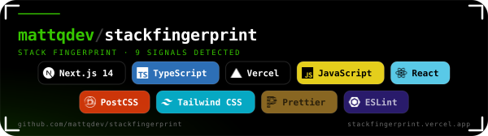
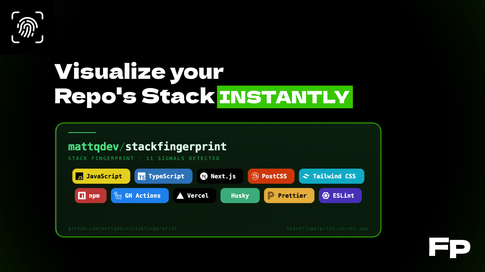
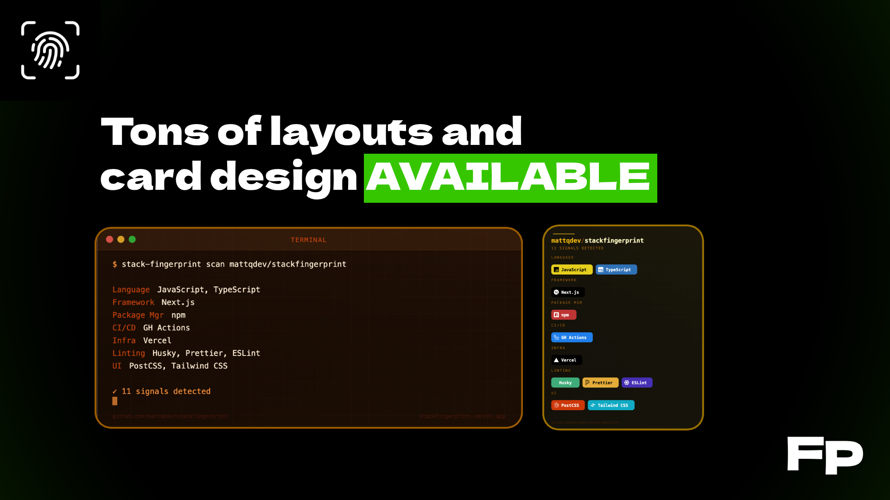

<div align="center">

# Stack Fingerprint 🔍


[](https://stackfingerprint.vercel.app)
[](https://github.com/mattqdev/stackfingerprint)
[](https://github.com/mattqdev/stackfingerprint/blob/main/LICENSE)
[](https://github.com/marketplace/actions/stack-fingerprint)

</div>

**Scan any public GitHub repo and generate a beautiful, embeddable SVG card of its tech stack.**

Zero auth. Zero config. Paste a repo, get a badge.

---

[](https://stackfingerprint.vercel.app/?repo=mattqdev/stackfingerprint)

---

## ✨ Design Your Card Visually

You don't need to touch a line of code to get the perfect look. The **Interactive Visual Builder** lets you customise your fingerprint in real-time:

- **Real-time preview** — see changes instantly as you toggle themes and layouts
- **10+ designer themes** — from the deep tones of `Obsidian` to the vibrant `Sakura`
- **5 distinct layouts** — choose `Terminal` for dev tools or `Banner` for project headers
- **One-click copy** — grab the Markdown or HTML snippet and drop it straight into your README

[**Try the Visual Builder →**](https://stackfingerprint.vercel.app)




---

## 🚀 Get your card

There are two ways to add a card to your README. Both take under a minute.

### Option A — GitHub Action (recommended)

The [**Stack Fingerprint Action**](https://github.com/marketplace/actions/stack-fingerprint) generates the SVG on GitHub's own runners and commits it to your repo, so your README serves a local file: no third-party image, no downtime, refreshed on every push.

`.github/workflows/stack-fingerprint.yml`:

```yaml
name: Stack Fingerprint

on:
  push:
    branches: [main]
  schedule:
    - cron: "0 4 * * 1" # weekly refresh
  workflow_dispatch:

permissions:
  contents: write

jobs:
  card:
    runs-on: ubuntu-latest
    steps:
      - uses: actions/checkout@v4
      - uses: mattqdev/stackfingerprint-action@v1
        with:
          theme: scanner
          layout: classic
```

Then in your README:

```markdown
[](https://stackfingerprint.vercel.app/?repo=OWNER/REPO)
```

All inputs (`layout`, `theme`, `icon-style`, `size`, `filter`, `path`, `output`, `commit`, `api-url`) are documented in the [Action README](https://github.com/mattqdev/stackfingerprint-action#inputs) and in [Docs.md → GitHub Action](./Docs.md#github-action).

### Option B — Quick embed

Just want to try it? Paste this into your README — the card is rendered live by `stackfingerprint.vercel.app`:

```markdown
[](https://stackfingerprint.vercel.app/?repo=OWNER/REPO)
```

Customise with query parameters (see [API reference](./Docs.md#api-reference)):

```markdown
[](https://stackfingerprint.vercel.app/?repo=vercel/next.js)
```

---

## 🔴 Common Problems

The community reported these most common problems, we have decided to fix all:
| ❌ Problem | ✅ Fix |
| ------------------------------------------------------------------------------------------------------ | -------------------------------------------------------------------------------------------------------------------------------------------------------------------------- |
| The embed is from an uncontrolled third-party domain | Use the [Stack Fingerprint Action](https://github.com/marketplace/actions/stack-fingerprint) — the SVG is committed to your repo (recommended) — or self-host with Vercel |
| Some of the stacks detected are unused/false positive/insignificant | You can choose to show: Top 5 stacks, Core only, Prod only etc; If this isn't enough you can decide to exclude singular stacks with `"ignore"` in `.stackfingerprint.json` |
| Full-repo scan surfaces signals from unrelated sub-projects | `?path=` query parameter scans a specific sub-directory; |
| Long signal lists discourage contributors and misrepresent the actual stack | `categoryFilter=prodonly` hides all dev signals; `categoryFilter=top` shows only `lang` + `framework`, capped at 5; dev-only signals visually dimmed even in `all` mode. You have the **FULL CONTROL** of **WHAT TO SHOW**. |

---

## ⚙️ Configuration file

Drop a `.stackfingerprint.json` file at your repo root (or at the sub-path you are scanning) to tune detection without touching any API parameter:

```json
{
  "ignore": ["babel", "webpack", "terraform"],
  "pin": ["nextjs", "typescript"],
  "labels": { "nextjs": "Next.js 14" },
  "path": "apps/web"
}
```

| Key      | Type       | Description                                                                  |
| -------- | ---------- | ---------------------------------------------------------------------------- |
| `ignore` | `string[]` | Signal IDs to suppress from the card, even if detected                       |
| `pin`    | `string[]` | Signal IDs to always show, even if not auto-detected                         |
| `labels` | `object`   | Override the display label for any signal ID                                 |
| `path`   | `string`   | Default sub-path for monorepo scans (overridden by the `?path=` query param) |

See [Docs.md → Configuration file](./Docs.md#configuration-file--stackfingerprintjson) for the full schema.

---

## 🛡 Supply-chain safety & self-hosting

> ⚠️ **Self-hosting recommended for production use.** See [Supply-chain safety](#-supply-chain-safety--self-hosting) below.

Embedding an image from a third-party domain (`stackfingerprint.vercel.app`) in a high-profile README introduces supply-chain risk: the domain owner can change what the URL serves at any time. **The recommended approach is to commit the SVG directly to your repository so it is served from GitHub's own CDN.**

The easiest way to do this is the [**Stack Fingerprint Action**](https://github.com/marketplace/actions/stack-fingerprint) — see [Option A](#option-a--github-action-recommended) above. The SVG is then served from GitHub itself, with no runtime dependency on `stackfingerprint.vercel.app`.

Prefer not to depend on a third-party Action at all? Copy [`.github/workflows/stack-fingerprint.yml`](./.github/workflows/stack-fingerprint.yml) from this repo instead: it does the same thing with plain `curl`, and you can audit every line.

### Deploy your own instance

For complete control, deploy a private instance in one click:

[](https://vercel.com/new/clone?repository-url=https://github.com/mattqdev/stackfingerprint)

Set the Action's `api-url` input to your own domain and you own the entire pipeline.

---

## 🏗 Monorepo support

For monorepos, add `?path=apps/web` to scan a sub-directory instead of the repository root:

```markdown

```

The `path` parameter is also accepted by the GitHub Action (`with: { path: apps/web }`) and as a key in `.stackfingerprint.json`.

---

## 🎨 Card options at a glance

| Parameter        | Values                                                                                     | Default    | Description                             |
| ---------------- | ------------------------------------------------------------------------------------------ | ---------- | --------------------------------------- |
| `repo`           | `owner/repo`                                                                               | —          | **Required.** GitHub repository to scan |
| `theme`          | See [themes](./Docs.md#themes)                                                             | `midnight` | Visual colour theme                     |
| `layout`         | `classic` `compact` `banner` `tall` `terminal` `minimal` `icons` `sidebar` `split` `cards` | `classic`  | Card layout                             |
| `size`           | `sm` `md` `lg` `xl`                                                                        | `md`       | Card size                               |
| `iconStyle`      | `color` `mono` `none` `icononly`                                                           | `color`    | Icon rendering style                    |
| `pillShape`      | `pill` `round` `square`                                                                    | `round`    | Shape of tech pills                     |
| `categoryFilter` | `all` `top` `core` `devtools` `infra` `prodonly`                                           | `all`      | Signal filter (see below)               |
| `path`           | `apps/web` etc.                                                                            | _(root)_   | Monorepo sub-path                       |

### `categoryFilter` options

| Value      | What it shows                                                                            |
| ---------- | ---------------------------------------------------------------------------------------- |
| `all`      | Every detected signal; dev-only signals are dimmed at 55 % opacity                       |
| `prodonly` | Production signals only — all `devDependencies`-sourced signals are hidden               |
| `top`      | Only `lang` + `framework` categories, capped at 5 signals — the minimal meaningful badge |

---

## 🛠 Contributing & support

This project thrives on community input. Before opening a pull request, **please open an issue first** so we can discuss the goal and make sure it is a good fit.

### 🎃 Hacktoberfest

Stack Fingerprint is participating in Hacktoberfest. Pick an issue labelled [`good first issue`](https://github.com/mattqdev/stackfingerprint/issues?q=is%3Aopen+label%3A%22good+first+issue%22): most are self-contained (one new theme, one new detected technology) and list exactly which files to touch.

### Help grow the signal database

Is your favourite framework missing? Adding a detection signal is one object in `src/data/signals.js`:

```js
{
  id: "astro",
  label: "Astro",
  color: "#FF5D01",
  textColor: "#ffffff",
  iconSlug: "astro",
  category: "framework",
  check: (f) => /^astro\.config/.test(f),
}
```

Technologies without a config file are detected from `package.json` / `pyproject.toml` / `Gemfile` / `composer.json` via the maps in `src/lib/detect.js`. See [CONTRIBUTING.md → Adding detection signals](./CONTRIBUTING.md#adding-detection-signals) for the full guide.

### Using the card? Get featured

If your README embeds a Stack Fingerprint card, [open a showcase request](https://github.com/mattqdev/stackfingerprint/issues/new?template=4_showcase.yml) to appear in the **Used by** section of the website.

---

## License

MIT — see [LICENSE](./LICENSE).

---

Built by [mattqdev](https://github.com/mattqdev) · If this saved you time, a ⭐ goes a long way.
